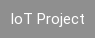
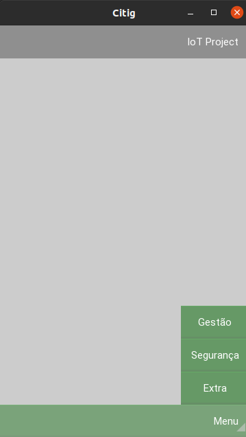
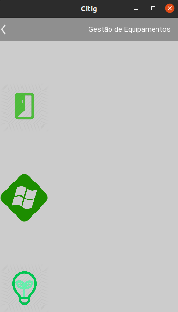
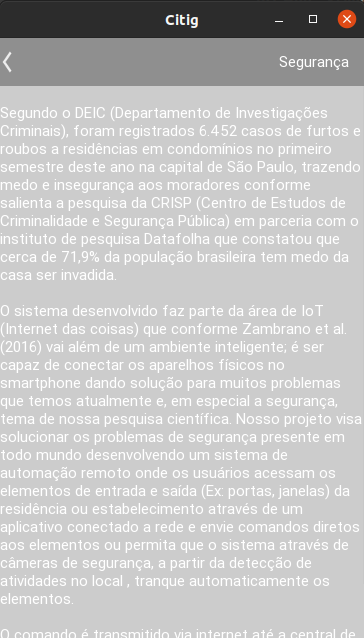

[![Contributors][contributors-shield]][contributors-url]
[![Forks][forks-shield]][forks-url]
[![Stargazers][stars-shield]][stars-url]
[![Issues][issues-shield]][issues-url]
[![MIT License][license-shield]][license-url]
[![LinkedIn][linkedin-shield]][linkedin-url]


<!-- PROJECT LOGO -->
<br />
<p align="center">
  <a href="https://github.com/ccr5/IoT-App">
    
  </a>

  <h3 align="center">IoT-App</h3>

  <p align="center">
    An app using kivy framework and scripts to begin your IoT project!
    <br />
    <a href="https://github.com/ccr5/IoT-App"><strong>Explore the docs »</strong></a>
    <br />
    <br />
    <a href="https://github.com/ccr5/IoT-App/issues">Report Bug</a>
    ·
    <a href="https://github.com/ccr5/IoT-App/issues">Request Feature</a>
  </p>
</p>


<!-- TABLE OF CONTENTS -->
<details open="open">
  <summary>Table of Contents</summary>
  <ol>
    <li>
      <a href="#about-the-project">About The Project</a>
      <ul>
        <li><a href="#built-with">Built With</a></li>
        <li><a href="#objective">Objective</a></li>
      </ul>
    </li>
    <li>
      <a href="#getting-started">Getting Started</a>
      <ul>
        <li><a href="#prerequisites">Prerequisites</a></li>
        <a href="#installation">Installation</a>
        <ul>
            <li><a href="#electronics">Electronics</a></li>
            <li><a href="#app">App</a></li>
        </ul>
      </ul>
    </li>
    <li>
        <a href="#usage">Usage</a>
        <ul>
            <li><a href="#home">Home</a></li>
            <li><a href="#controls">Controls</a></li>
            <li><a href="#extra">Extra</a></li>
        </ul>
    </li>
    <li><a href="#roadmap">Roadmap</a></li>
    <li><a href="#contributing">Contributing</a></li>
    <li><a href="#license">License</a></li>
    <li><a href="#contact">Contact</a></li>
  </ol>
</details>


<!-- ABOUT THE PROJECT -->
## About The Project

[![Product Name Screen Shot][product-screenshot]](https://github.com/ccr5/IoT-App)

It's a project to help students to learning about Internet of Things.

There is many documents to help to create a IoT project as Arduino and ESP8266 NodeMCU scripts and a Python App to control all.

it's part of a scientific research that we want to help everybody to control and protect your home and you can read about in my LinkedIn: 

https://www.linkedin.com/in/mattnobre/ 

### Objective
A open project that everybody can use to create a IoT environment.

### Built With

* [Kivy](https://kivy.org)
* [Arduino](https://www.arduino.cc)


<!-- GETTING STARTED -->
## Getting Started

To get a local copy up and running follow these simple example steps.

### Prerequisites

This is an example of how to list things you need to use the software and how to install them.
* kivy
  ```sh
  pip install kivy
  ```

### Installation

#### Electronics

You will need to: 
1. 2 un - Arduino Uno R3
2. 2 un - ESP8266 NodeMCU CP2101
3. 1 un - Display LCD 16x2
4. 1 un - Biometric Sensor
5. 1 un - Lock
6. 1 un - Relay
7. 1 un - Lamp

You must to charge each ArduinoWifiScript in an Arduino and WifiScript in an ESP8266 NodeMCU. 
Using jumpers to connect every pin in its respective component. Done! You just need power in each system. 
Until run the app, change the IP and WiFi network in WifiScript.ino and citig.kv to works.

#### App

1. Clone the repo
   ```sh
   git clone https://github.com/ccr5/IoT-App.git
   ```
2. Install pip packages
   ```sh
   pip install -r requirements.txt
   ```
3. run main.py
   ```sh
   python main.py
   ```

<!-- USAGE EXAMPLES -->
## Usage

### Home

The home page gives you access has a basic appearance to add and change as needed.

<p align="center">
  <a href="https://github.com/ccr5/IoT-App">
    
  </a>
</p>

### Controls

The control page gives you access to icons to manipulate your electronics.

<p align="center">
  <a href="https://github.com/ccr5/IoT-App">
    
  </a>
</p>

### Extra

The add-on page presents a part of the article and motivation for creating this repository.

<p align="center">
  <a href="https://github.com/ccr5/IoT-App">
    
  </a>
</p>

<!-- ROADMAP -->
## Roadmap

See the [open issues](https://github.com/ccr5/IoT-App/issues) for a list of proposed features (and known issues).


<!-- CONTRIBUTING -->
## Contributing

Contributions are what make the open source community such an amazing place to be learn, inspire, and create. Any contributions you make are **greatly appreciated**.

1. Fork the Project
2. Create your Feature Branch (`git checkout -b feature/AmazingFeature`)
3. Commit your Changes (`git commit -m 'Add some AmazingFeature'`)
4. Push to the Branch (`git push origin feature/AmazingFeature`)
5. Open a Pull Request


<!-- LICENSE -->
## License

Distributed under the MIT License. See `LICENSE` for more information.


<!-- CONTACT -->
## Contact

Matheus Nobre Gomes - matt-gomes@live.com

Project Link: [https://github.com/ccr5/IoT-App](https://github.com/ccr5/IoT-App)


<!-- MARKDOWN LINKS & IMAGES -->
<!-- https://www.markdownguide.org/basic-syntax/#reference-style-links -->
[contributors-shield]: https://img.shields.io/github/contributors/ccr5/IoT-App.svg?style=for-the-badge
[contributors-url]: https://github.com/ccr5/IoT-App/graphs/contributors
[forks-shield]: https://img.shields.io/github/forks/ccr5/IoT-App.svg?style=for-the-badge
[forks-url]: https://github.com/ccr5/IoT-App/network/members
[stars-shield]: https://img.shields.io/github/stars/ccr5/IoT-App.svg?style=for-the-badge
[stars-url]: https://github.com/ccr5/IoT-App/stargazers
[issues-shield]: https://img.shields.io/github/issues/ccr5/IoT-App.svg?style=for-the-badge
[issues-url]: https://github.com/ccr5/IoT-App/issues
[license-shield]: https://img.shields.io/github/license/ccr5/IoT-App.svg?style=for-the-badge
[license-url]: https://github.com/ccr5/IoT-App/blob/master/LICENSE.txt
[linkedin-shield]: https://img.shields.io/badge/-LinkedIn-black.svg?style=for-the-badge&logo=linkedin&colorB=555
[linkedin-url]: https://linkedin.com/in/mattnobre
[product-screenshot]: images/home.png


# What can I do with this?
You will need to: 
1. 2 un - Arduino Uno R3
2. 2 un - ESP8266 NodeMCU CP2101
3. 1 un - Display LCD 16x2
4. 1 un - Biometric Sensor
5. 1 un - Lock
6. 1 un - Relay
7. 1 un - Lamp

You must to charge each ArduinoWifiScript in an Arduino and WifiScript in an ESP8266 NodeMCU. 
Using jumpers to connect every pin in its respective component. Done! You just need power in each system. 
Until run the app, change the IP and WiFi network in WifiScript.ino and citig.kv to works.

